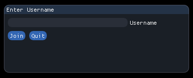
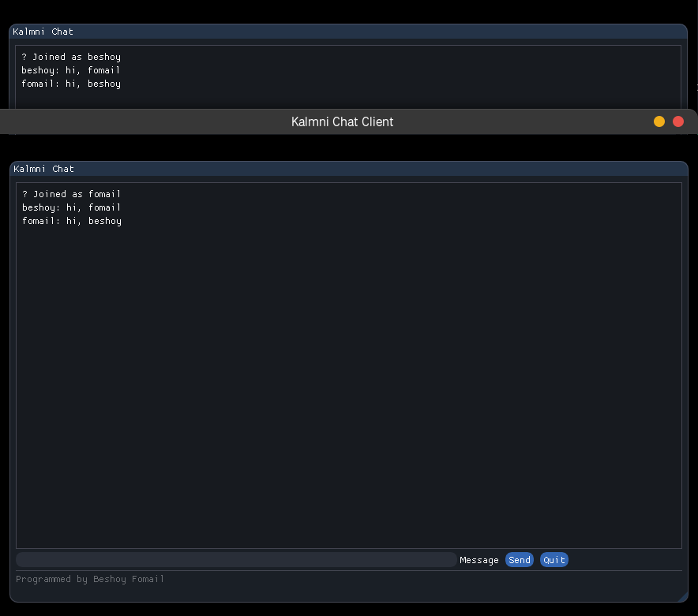

<div align="center">

# 📬 Kalmni

**A real-time TCP chat application built in C++ with an ImGui GUI**


Kalmni is a lightweight, cross-platform chat application using a **client/server TCP architecture**. Multiple clients can connect and exchange messages in real time through a clean, blue-themed ImGui interface.

</div>

---

## ✨ Features

- Real-time messaging between multiple connected clients
- Custom usernames displayed alongside each message
- Clean, modern blue-themed UI powered by Dear ImGui
- Press **Enter** to send messages instantly
- Graceful quit via a dedicated button
- Works over **LAN** or the **internet** (with port forwarding)
- Multithreaded server handles concurrent clients independently
- Clean server shutdown via signal handling (`Ctrl+C`)

---

## 🛠 Tech Stack

| Layer | Technology |
|---|---|
| Language | C++17 |
| Networking | Boost.Asio (TCP) |
| GUI | Dear ImGui |
| Rendering Backend | OpenGL + GLFW |
| Concurrency | `std::thread` + `std::mutex` |
| Build System | CMake / Makefile |

---

## 📁 Project Structure

```
Kalmni_Chat_Complete/
├── client/              # Client source code + ImGui source files
│   ├── client.cpp
│   └── imgui/           # Bundled Dear ImGui source
├── server/              # Server source code
│   └── server.cpp
├── screenshots/
│   ├── login_window.png
│   └── chat_window.png
└── README.md
```

---

## ⚙️ Prerequisites

Make sure the following are installed before building:

### Linux (Debian/Ubuntu/Arch)

```bash
# Debian / Ubuntu
sudo apt install build-essential libboost-all-dev libglfw3-dev libgl1-mesa-dev

# Arch / EndeavourOS
sudo pacman -S boost glfw-x11 mesa base-devel
```

### macOS

```bash
brew install boost glfw
```

### Windows

- Install [MSYS2](https://www.msys2.org/) and use `pacman` to get Boost and GLFW, or
- Use [vcpkg](https://github.com/microsoft/vcpkg): `vcpkg install boost glfw3`

---

## 🚀 Getting Started

### 1. Clone the Repository

```bash
git clone https://github.com/beshoy-13/Kalmni_Chat_Complete.git
cd Kalmni_Chat_Complete
```

### 2. Build the Server

```bash
cd server
g++ server.cpp -o server -lboost_system -pthread
```

### 3. Build the Client

```bash
cd client
g++ client.cpp imgui/*.cpp -Iimgui -o client -lboost_system -lGL -lglfw -pthread
```

> **Note:** On macOS, replace `-lGL` with `-framework OpenGL` and `-lglfw` with the Homebrew GLFW path.

---

## 🖥 Running Kalmni

### Start the Server

Run this **first** on the machine that will host the chat:

```bash
./server
```

The server listens on the default port. Stop it anytime with `Ctrl+C`.

### Start the Client(s)

Run this on each machine that wants to join:

```bash
./client
```

On launch, you will be prompted to:
1. Enter the **server's IP address** (use `127.0.0.1` for local testing)
2. Enter your **username**

Once connected, type a message and press **Enter** or click **Send**.

---

## 🌐 Using Over the Internet

To chat across different networks:

1. On the server machine, **forward the chat port** (default: `12345`) in your router settings to the server's local IP.
2. Share your **public IP** with others.
3. Clients enter the public IP when connecting.

---

## 📷 Screenshots

| Login Window | Chat Window |
|---|---|
|  |  |

---

## 🔧 Troubleshooting

| Problem | Solution |
|---|---|
| `libboost_system not found` | Install `libboost-all-dev` (Debian) or `boost` (Arch/macOS) |
| `GLFW/glfw3.h not found` | Install `libglfw3-dev` or `glfw-x11` |
| Client can't connect | Make sure server is running before client; check firewall rules |
| Black screen / no window | Ensure OpenGL drivers are installed (NVIDIA/AMD/Mesa) |
| Port already in use | Kill any existing server instance or change the port in source |

---

## 🗺 Roadmap

- [ ] Configurable port via command-line argument
- [ ] Message timestamps
- [ ] Multiple named chat rooms
- [ ] Message history persistence
- [ ] Encrypted communication (TLS via Boost.Asio SSL)
- [ ] Windows native build (Winsock backend)

---

## 👤 Author

**Beshoy Fomail Labib**

[](https://github.com/beshoy-13)
[](https://www.linkedin.com/in/beshoy-fomail)
[](mailto:beshoy.f.labib@outlook.com)
